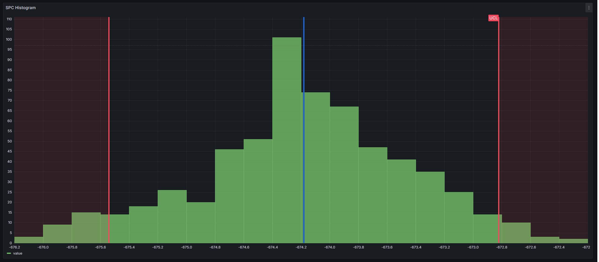

## SPC Histogram

Welcome to the KensoBI SPC Histogram panel for Grafana. This plugin enables you to easily create statistical process control (SPC) histograms, including Xbar-R, XbarS, and XmR charts. It automatically calculates and displays control limits on the histogram as vertical lines, with options to add your own custom limits. Additionally, you can group your samples into subgroups and aggregate them using methods such as moving range, range, mean, or standard deviation.

## Features

- **Xbar-R, XbarS, and XmR Charts:** Create various types of SPC charts.
- **Automatic Control Limits:** LCL, UCL and mean control limits are automatically calculated and displayed.
- **Custom Limits:** Add your own limits for more tailored analysis.
- **Subgrouping:** Group your samples into subgroups and aggregate it.
- **Aggregation:** Aggregate your data by moving range, range, mean, or standard deviation.

## Getting Help

If you have any questions or feedback, you can:

- Ask a question on the [KensoBI Discord channel](https://discord.gg/bekfAuAjGm).
- Create an [issue](https://github.com/KensoBI/spc-histogram/issues) to report bugs, issues, and feature suggestions.

Your feedback is always welcome!

## License

This software is distributed under the [AGPL-3.0-only](./LICENSE).

## Notes

Copyright (c) 2024 [Kenso Software](https://kensobi.com)
